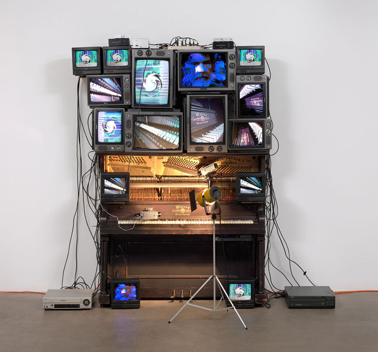
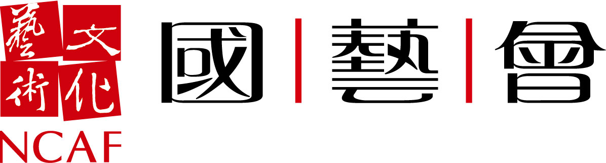

<section id="about" class="section scrollspy" markdown="1">

媒體藝術事務（Matters in Media Art）為致力於有關媒體藝術的資訊資源

白南準 Untitled (1993)。鋼琴、15台電視機、2台攝影機、2台鐳射光碟播放器、1盞電燈與燈泡和電線，整體約8′ 4″ x 8′ 9″ x 48″ （254 x 266.7 x 121.9公分），包括鐳射光碟播放器和燈。紐約現代藝術博物館。Bernhill基金、Gerald S. Elliot基金、Margot Paul Ernst的捐贈和購買。©2013白南準資產管理

</section>

<section id="project-history" class="section scrollspy" markdown="1">

## 計畫歷史

本合作計畫啟動於2005年，為新藝術信託（New Art Trust, NAT）與其合作美術館－紐約現代藝術博物館（the Museum of Modern Art (MoMA)）、舊金山現代藝術博物館（the San Francisco Museum of Modern Art (SFMOMA)）和泰德美術館（Tate）－共同設計，期望協助媒體藝術作品之收藏與保存（例如錄像、電影、聲音及軟體驅動之裝置作品）。

最初的設想是由新藝術信託的三個合作美術館共同建立一個計畫，而長程目標則是透過發展維護與保存作品的共同實踐，來確保我們對媒體藝術和藝術家的承諾。一直以來，本協會期盼這三所美術館能夠對新興的管理實踐達成共識，然後透過線上技術實踐的分享，能再廣邀更多藝術家和收藏家使用、改善並臻於完備。

</section>

<section id="contribution-guidelines" class="section scrollspy" markdown="1">

## 貢獻指南

在我們更新網站的同時，我們非常樂於收到任何來自你的回饋。請撥冗填寫我們的問卷，以協助我們日後改善網站。

媒體藝術事務（Matters in Media Art）網站遵循 [開放資源哲學](https://opensource.org/osd) 的基本原則。所有網站的原始碼和內容都能在GitHub主機上存取，GitHub提供了一個軟體框架，讓所有人都可以針對mattersinmediaart.org網站的內容和／或設計及功能性提供建議、進行討論和編輯。

這種開放原始碼的基礎，是我們選擇授權。所有mattersinmediaart.org網站上的開放原始碼，皆是在[MIT license](https://en.wikipedia.org/wiki/MIT_License), 下授權，所有的著作內容（除非另有說明）都是在 [創用CC授權條款4.0版](http://creativecommons.org/licenses/by/4.0/) 許可下授權。雖然這兩種許可授權方式各異，但一般來說，這代表所有mattersinmediaart.org網站的內容和原始碼都可以開放複製、分享、使用、重製和傳播。

### 貢獻

我們歡迎任何對這個主題有興趣的人向mattersinmediaart.org提供內容、回饋和貢獻。為mattersinmediaart.org提供貢獻並不需要任何的技術專長，因為貢獻方式分為兩種，其中一種相當簡單！

第一種，也是最簡單的貢獻方式，就是在 [GitHub頁面](https://github.com/matters-in-media-art/mattersinmediart.org/issues)上「回報問題」。GitHub問題可以被用在討論內容或功能性方面的錯誤或問題，並提供我們討論問題的對話。 [點選這裡參閱在Github上回報問題的操作指南。](https://help.github.com/articles/creating-an-issue/).

第二種回饋mattersinmediaart.org的方式，則是編輯網站內容或原始碼，並將編輯內容透過GitHub上「pull request」的機制傳送內容以供審核。 [點選這裡參閱傳送pull request的操作指南。](https://help.github.com/articles/using-pull-requests/).

<!--

make a note about how we are accepting pull requests, but not new repo admins at the moment

also some text about how we are a small team of volunteers and time is limited

link to the contributors page and explain the distinction between project team and contributors

-->

</section>

<section id="the-team" class="section scrollspy" markdown="1">

## 計畫團隊
* Amy Brost, Andrew W. Mellon Fellow in Media Conservation, MoMA
* Jim Coddington, Agnes Gund Chief Conservator, MoMA
* Patricia Falcao, Time-based Media Conservator, Tate
* Ben Fino-Radin, Associate Media Conservator, MoMA
* Martina Haidvogl, Associate Media Conservator, SFMOMA
* Mark Hellar, Consultant, Hellar Studios LLC
* Anna Henry, Digital Preservation Manager, Tate
* Pip Laurenson, Head of Collection Care Research, Tate
* Kate Lewis, Media Conservator, MoMA
* Peter Oleksik, Assistant Media Conservator, MoMA
* Claudia Roeck, Assistant Media Conservator, Tate
* Jill Sterrett, Director of Collections and Conservation, SFMOMA

### 過往

* John Alexander, Senior Assistant Registrar, MoMA
* Nancy Adelson, Deputy General Counsel, MoMA
* Ramona Bannayan, Senior Deputy Director, Exhibitions and Collections, MoMA
* Michelle Barger, Deputy Head of Conservation/Conservator of Objects, SFMOMA
* Bryony Bery, Sculpture Conservation Researcher/Administrator, Tate
* Sydney Briggs, Associate Registrar, Collections, MoMA
* Catherine Clement, Senior Loans Registrar, Tate
* Allison Cummings, Assistant Registrar for Permanent Collection, SFMOMA
* Stuart Comer, Chief Curator of Media and Performance Art, MoMA
* Corey D’Augustine, Conservation Fellow, MoMA
* Katie Dance, E-Collection Curator, Tate
* Margo Delidow, Conservation Fellow, MoMA
* Sophie Dijan, Conservation Administration, Tate
* Steve Dye, Exhibitions Technical Manager, SFMOMA
* Christopher Eamon, Director, New Art Trust on Matters in Media Art, SFMOMA
* Adrian George, Curator, Tate
* Lisa Hayes, Loans Registrar, Tate
* David Hollely, Production Manager, Exhibition Design & Production, MoMA
* Charlie Kalinowski, Media Services Manager, AV, MoMA
* Wynne Kettell, Registrar Intern, MoMA
* Barbara London, Associate Curator, Media, MoMA
* K Mita, Director, Audio Visual & e-Commerce Technology, MoMA
* Anne Morra, Assistant Curator, Department of Film and Media, MoMA
* Sarah Joyce, Senior Conservator for Time-Based Media, Tate
* Alice Keys-Toyer, Art Handling Administrator, Tate
* Jon Lewis, Senior Conservation Technician for Time-Based Media, Tate
* Gregor Muir, Kramlich Curator of Contemporary Art, Tate
* Alex Musson, Web Developer, Tate
* Anna Nesbit, AV Manager Art Handling, Tate
* Kate Parsons, Head Registrar, Tate
* Marie-Chantale Poisson, Fellow in the Conservation of Contemporary Art, SFMOMA
* Gwynne Barney Ryan, Fellow in the Conservation of Contemporary Art, SFMOMA
* Kellie Schneider, Conservation Administrator, Tate
* Cara Starke, Curatorial Assistant, Media, MoMA
* Sarah Tinsley, Senior Digital Content Manager, Tate
* Glenn Wharton, Clinical Associate Professor of Museum Studies, NYU
* Allyson Wolfe, Registrar Assistant, MoMA
* Tanya Zimbardo, Assistant Curator in Media Arts, SFMOMA

#### 協助者
George Gawlinski

除上述參與者外，此計畫也號召了世界各地和參與機構內的眾多同業人員投入的時間和專業知識。

最後，我們要感謝Pam和Dick Kramlich以及新藝術信託的董事們，他們對媒體藝術的承諾使這個計畫得以落實。

#### 繁體中文翻譯計畫團隊成員

臺灣數位藝術基金會
科技藝術典藏基礎計畫 Save Media Art
計畫主持人：陳禹先
計畫國際交流主任：林子荃
翻譯：王幸慈、彭庭軒
同行審查：陳娟娟、施登騰
網站程式：曾能鴻
網站維運：臺灣數位藝術基金會
贊助單位：國家文藝基金會

</section>
