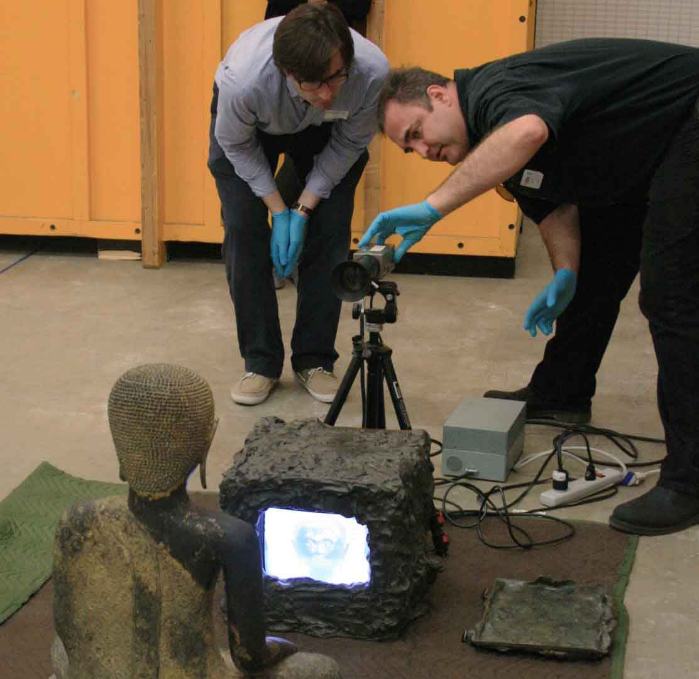
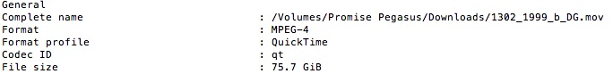

媒體藝術作品通常需要複雜、跨領域的文件紀錄形式，這對傳統的編目系統來說是種挑戰。策展人、研究人員、登錄人員、展覽技術布展人員、資訊科技專家、智慧財產管理人員、修復人員、外部專家與藝術家更使每件藝術作品有著多元角度和聲音的紀錄。

 

新藝術信託的艾柏莉克‧柯爾曼 (Aebhric Coleman) 和舊金山現代藝術博物館的史提夫‧戴 (Steve Dye) 正在紀錄白南準 (Nam June Paik) 1989年之作品《電視佛陀》(TV Buddha)。照片提供：舊金山現代藝術博物館

 <!-- start of slider -->

<h2 class="title"></h2>
<h2>典藏作品資料彙整</h2>
將作品入藏過程中所取得的詳細資訊，輸入至藏品資料庫中，應至少包括以下資訊：

* 藝術家、作品名稱、創作年代、展出尺寸、版次
* 媒體格式、作品時間長度
* 展示設備、雕塑組件
* 來源、展覽經歷
* 登錄／典藏編號
* 估價、購藏價格
* 作品／來源附註

作品檔案的其他相關資訊可以到資料庫，或是以硬拷貝形式單純地追蹤與保存。

<h2 class="title"></h2>
<h2>藝術作品組件的清單及標籤</h2>

* 媒體：例如錄像、聲音、電影、幻燈片、硬碟。

* 實用網站: [EAI 線上資源指南](http://www.eai.org/resourceguide/formats.html){:target="_blank"}、 [德州委員會錄影帶識別及檢視指南](http://www.arts.state.tx.us/video/){:target="_blank"} 、[獨立媒體藝術保存 (IMAP) 編目計畫](http://www.imappreserve.org/cat_proj/){:target="_blank"}

* 專用的展示設備：（例如螢幕、顯示器、投影機、喇叭、重播  設備、燈光、相機）。記錄廠商名稱及型號編號，並收集所有設備的產品使用手冊。

* 實用網站：[莫娜・吉梅內斯 (Mona Jimenez)：藝術家儀器資料庫](http://www.fondation-langlois.org/html/e/page.php?NumPage=708){:target="_blank"}

* 雕塑組件：測量並記錄所有的安裝物件。

<h2 class="title"></h2>
<h2>彙整所收集之資訊</h2>
由作品購藏過程，創建物品檔案及紀錄文件

這些檔案將隨著作品的展出、借展及維護而增加。大多數的機構會為不同目的製作各別檔案，例如購藏、策展、維護和資料登錄。這些訊息大部分也會以電子檔案方式儲存在藏品資料庫、文字文件和數位影像。

 <!-- end of slider -->

<section id="cataloging" class="section scrollspy" markdown="1">

## 媒體藝術編目

供媒體裝置使用的媒體藝術編目紀錄，包含了龐大且可能較難以管理的資訊。透過以下的指南說明，你可以在媒體藝術作品的紀錄中找到其材料類型，以及獲得如何在你的檔案及資料夾裡進行資料管理和分類的建議方式。在這裡閱讀更多關於 [藏品管理系統]({{ site.url }}/mattersinmediaart.org/sustaining-your-collection.html#Review-Collection-Management-Systems){:target="_blank"} 的資訊。

<ul class="collapsible" data-collapsible="accordion">
<li>
  
作品

  

 * 存取編號
 * 藝術家
 * 作品名稱
 * 媒材
 * 作品說明
 * 作品尺寸
 * 作品時間長度
 * 影像尺寸（最大／最小）
 * 展示空間尺寸

</li>
<li>
  
入藏與登錄

  

* 點交憑據
* 銷售單據
* 購買同意書／贈與契據
* 在某些情況中，你需要一份委託同意書或共同持有同意書作為法律文件
* 策展提案
* 原版作品證明書或證明書副本
* 作品版權授權同意書
* 購藏信函
* 媒體／展示設備／雕塑組件原始清單亦是作品購藏的一部分
* 費用評估
* 入藏評估

</li>

<li>
  
專用組件資訊

  

* 媒體
* 媒體組件的圖表或清單顯示其格式與製作完成之時間、材料和用途
* 展示設備
* 隨作品入藏的專用設備清單（請詳列專用之處）
* 操作手冊
* 雕塑組件

</li>

<li>
  
展示規格需求

  

* 安裝規格需求
* 平面圖和佈線圖等等

</li>

<li>
  
展出經歷

  

 * 過往展出紀錄列表
 * 展出資訊及其他作品版本之相關資訊
 * 過往展出圖片紀錄
 * 過往展出文字紀錄
 * 展示摘要，包含使用設備、展示期間狀況紀錄、展示維護步驟、預算、作品安裝配置、展覽用格式需求說明、照片紀錄及相關通聯信函。
 * 借展文件

</li>

<li>
  
藝術家資訊

  

 * 藝術家和代理畫廊的聯絡資訊
 * 與藝術家的通聯紀錄
 * 藝術家建議之技術規格說明
 * 創作自述
 * 相關訪談

</li>

<li>
  
藝術史研究資料／脈絡

  

 * 作品的相關文件，包含作品的其他版本
 * 展覽評論

</li>

<li>
  
作品結構和狀況評估

  

  * 結構及狀況報告書

</li>

<li>
  
常態維護

  

 * 媒體轉置紀錄
 * 範本
 * 修復處理報告／照片紀錄
 * 重大損害紀錄
 * 儲藏指示說明
 * 損害處理建議
 * 科學檢測報告
 * 包裝及運輸指示說明

</li>
</ul>

<h2 class="title"></h2>
<h2>作品安裝文件建檔</h2>
請檢閱藝術家／賣家／捐贈者所提供之文件紀錄，確保資料足夠提供長期保存維護及未來展示之用。

* 為媒體藝術進行檔案建置，需記錄作品入藏時的狀況：
* 以平面攝影記錄裝置與其各別組件
* 以動態攝影記錄首次安裝過程
* 將安裝計畫及展示規格需求予以建檔

<h2 class="title"></h2>
<h2>安排藝術家訪談</h2>
藝術家訪談可能包含與藝術家、技術人員、作品所有權人、美術館館員和其他熟悉作品相關人員的對話。訪談目標為蒐集作品過往的技術資料、展覽需求、藝術家創作動機和技術過時等資訊。

（關於藝術家訪談的指南，可以參閱[國際當代藝術保存網 INCCA 網站](http://www.incca.org/){:target="_blank"}）

建立訪談檔案紀錄。若此紀錄可以公開分享，有利於其他同業參考，可考量加入國際當代藝術保存網 (INCCA)，並將訪談摘要保存於 [INCCA藝術家檔案資料庫中](http://www.incca.org/){:target="_blank"}

<h2 class="title"></h2>
<h2>規劃保存維護計畫</h2>
保存維護計畫旨在於規劃下述內容：

* 作品裝置設備：作品維護需求及未來可供替換之設備
* 媒體轉置週期
* 儲存需求規格
* 未來保存維護策略及預估費用

關於保存媒體作品的相關資訊，可參考以下網站：

* [EAI 線上資源指南—媒體藝術的展示、收藏及保存](http://www.eai.org/resourceguide/){:target="_blank"}
* [獨立媒體藝術保存 IMAP Preservation 101](http://www.imappreserve.org/pres_101/index.html){:target="_blank"}

<h2 class="title"></h2>
<h2>未來展示準備工作</h2>

* 視展覽需求製作展示用副本
* 未來展覽之相關費用估算

<h2 class="title"></h2>
<h2>作品包裝及儲存</h2>

* 適當的儲存及包裝有助於延長作品壽命。
* 媒體儲存需考量之處可參考 <a target="_blank" href="http://www.imappreserve.org/pres_101/index.html#storage">IMAP Preservation 101</a> 針對作品儲存之說明。

 <!-- end of slider -->

</section>

<section id="post-templates" class="section scrollspy" markdown="1">

## 作品狀況報告書範本

在檢視媒體藝術時，我們也試圖將現行作品狀況報告書的撰寫方式，應用在媒體藝術作品的檢視上。作品狀況報告書為未來的作品檢視提供了對照基準。針對媒體藝術創作的作品，其狀況報告書需分為三個部分——媒體、設備及整體裝置。媒體藝術之作品狀況書不同於傳統藝術作品，因其部分組件可能較易取得，並可以替換。作品中的任何組件，它的價值和重要性皆來自作品本身的特性，通常不太可能單看組件內容就予以定義。除下列報告書範本外，請參考古根漢美術館時基媒體修復師喬安娜・菲利普斯 (Joanna Phillip) 的[時基媒體修復專文](http://www.guggenheim.org/conservation/time-based-media){:target="_blank"}。
 
<!-- previous layout:
* [結構與狀況報告]({{ site.url }}/mattersinmediaart.org/downloads/structure_and_condition_reports.rtf){:target="_blank"} (RTF, 180KB)
* [錄像（Video）作品]({{ site.url }}/mattersinmediaart.org/downloads/mattersmediaart_structureconditionreport_videoprompt.rtf){:target="_blank"} (RTF, 81KB)
* [聲音作品]({{ site.url }}/mattersinmediaart.org/downloads/mattersmediaart_structureconditionreport_audioprompt.rtf){:target="_blank"} (RTF, 77KB)
* [膠卷影像（Film）作品]({{ site.url }}/mattersinmediaart.org/downloads/mattersmediaart_structureconditionreport_filmprompt.rtf){:target="_blank"} (RTF, 103KB)
* [幻燈片作品]({{ site.url }}/mattersinmediaart.org/downloads/mattersmediaart_structureconditionreport_slideprompt.rtf){:target="_blank"} (RTF, 92KB)
* [基於電腦的作品]({{ site.url }}/mattersinmediaart.org/downloads/mattersmediaart_structureconditionreport_computuerworksprompt.rtf){:target="_blank"} (RTF, 73KB)
* [基於電腦作品的設備]({{ site.url }}/mattersinmediaart.org/downloads/mattersmediaart_structureconditionreport_computerequipment.rtf){:target="_blank"} (RTF, 92KB)
* [播放裝置展示設備]({{ site.url }}/mattersinmediaart.org/downloads/mattersmediaart_structureconditionreport_playbackdevice.rtf){:target="_blank"} (RTF, 102KB)
* [投影展示設備]({{ site.url }}/mattersinmediaart.org/downloads/mattersmediaart_structureconditionreport_videoprojectors.rtf){:target="_blank"} (RTF, 125KB)
* [螢幕展示設備]({{ site.url }}/mattersinmediaart.org/downloads/mattersmediaart_structureconditionreport_screensmonitors.rtf){:target="_blank"} (RTF, 122KB)
* [膠卷影像放映展示設備]({{ site.url }}/mattersinmediaart.org/downloads/mattersmediaart_structureconditionreport_filmprojectors.rtf){:target="_blank"} (RTF, 114KB)
* [幻燈片投影展示設備]({{ site.url }}/mattersinmediaart.org/downloads/mattersmediaart_structureconditionreport_slideprojectors.rtf){:target="_blank"} (RTF, 114KB)
-->

<a href="{{ site.url }}/mattersinmediaart.org/downloads/structure_and_condition_reports.rtf">
  
<i class="large material-icons">play_for_work</i>結構與狀況報告
    

    </a>
    

 

<a href="{{ site.url }}/mattersinmediaart.org/downloads/mattersmediaart_structureconditionreport_videoprompt.rtf">
  
<i class="large material-icons">play_for_work</i>錄像 (Video) 作品
    

    </a>
    

 

<a href="{{ site.url }}/mattersinmediaart.org/downloads/mattersmediaart_structureconditionreport_audioprompt.rtf">
  
<i class="large material-icons">play_for_work</i>聲音作品
    

    </a>
    

 

<a href="{{ site.url }}/mattersinmediaart.org/downloads/mattersmediaart_structureconditionreport_filmprompt.rtf">
  
<i class="large material-icons">play_for_work</i>膠卷影像 (Film) 作品
    

    </a>
    

 

<a href="{{ site.url }}/mattersinmediaart.org/downloads/mattersmediaart_structureconditionreport_slideprompt.rtf">
  
<i class="large material-icons">play_for_work</i>幻燈片作品
    

    </a>
    

 

<a href="{{ site.url }}/mattersinmediaart.org/downloads/mattersmediaart_structureconditionreport_computuerworksprompt.rtf">
  
<i class="large material-icons">play_for_work</i>基於電腦的作品
    

    </a>
    

 

<a href="{{ site.url }}/mattersinmediaart.org/downloads/mattersmediaart_structureconditionreport_computerequipment.rtf">
  
<i class="large material-icons">play_for_work</i>基於電腦作品的設備
    

    </a>
    

 

<a href="{{ site.url }}/mattersinmediaart.org/downloads/mattersmediaart_structureconditionreport_playbackdevice.rtf">
  
<i class="large material-icons">play_for_work</i>播放裝置展示設備
    

    </a>
    

 

<a href="{{ site.url }}/mattersinmediaart.org/downloads/mattersmediaart_structureconditionreport_videoprojectors.rtf">
  
<i class="large material-icons">play_for_work</i>投影展示設備
    

    </a>
    

 

<a href="{{ site.url }}/mattersinmediaart.org/downloads/mattersmediaart_structureconditionreport_screensmonitors.rtf">
  
<i class="large material-icons">play_for_work</i>螢幕展示設備
    

    </a>
    

 

<a href="{{ site.url }}/mattersinmediaart.org/downloads/mattersmediaart_structureconditionreport_filmprojectors.rtf">
  
<i class="large material-icons">play_for_work</i>膠卷影像 (Film) 放映展示設備
    

    </a>
    

 

<a href="{{ site.url }}/mattersinmediaart.org/downloads/mattersmediaart_structureconditionreport_slideprojectors.rtf">
  
<i class="large material-icons">play_for_work</i>幻燈片投影展示設備
    

    </a>
    

 

</section>

<section id="guidelines" class="section scrollspy" markdown="1">

</section>

<section id="Assessment" class="section scrollspy" markdown="1">

</section>

<section id="assessing" class="section scrollspy" markdown="1">
## 數位錄像檔案檢測

彼得‧奧萊克希克檢測理查‧賽拉 (Richard Serra) 及南西‧霍特 (Nancy Holt)之作品《迴旋鏢》(Boomerang, 1974)  

檢視數位錄像媒體，是作品入藏相當重要的步驟。這不僅有助於你理解檔案的技術層面和可能會發生的異常狀況，它也提供了作品的基準狀態，以供你日後檢視之參考，並讓你更了解每件作品以及典藏品的整體狀況。

使用適當的工具，來評估並檢查錄像檔案的畫面及聲音播放是否正常。本節內容包含相關工作環境的設計需求、對檔案進行首次技術分析的方法，以及影像品質與音質的技術評估及建檔記錄。

<ul class="collapsible" data-collapsible="accordion">
<li>
  
<i class="material-icons">visibility</i>視覺檢測

  

  	

  		亮度、色度、色彩空間和伽瑪校正都是影像品質評估的關鍵特點 
    <strong>視覺檢測工具</strong>
  	

   <ul>
    <li>監看顯示器（SD標準畫質v.s. HD高畫質）</li>
    <li>示波器</li>
    <li>播放軟體</li>
   </ul>
  

</li>
<li>
  
<i class="material-icons">hearing</i>聽覺檢測

  

聽覺檢測的關鍵特點為：電平值（分貝與音量單位）、相位

   <ul>聽覺檢測工具
    <li>分貝計（數位）</li>
    <li>相位示波器</li>
    <li>顯示器</li>
    <li>波形視覺化</li>
   </ul>
  

</li>
<li>
  
<i class="material-icons">warning</i>視覺與聽覺假象 (Artifacts)

  

   <ul>
    <li>類比假象</li>
    <li>數位假象</li>
    <li>辨識成因／原作—A/V假象圖冊 (Artifact Atlas)</li>
   </ul>
  

</li>
</ul>

</section>

<section id="workstation" class="section scrollspy" markdown="1">

### 檢測工作站

為了要檢視檔案、控管品質及記錄數位錄像作品檔案狀況，你可能需要依照需求，打造一個專為檔案檢視之用的工作環境。以下根據不同預算、不同層級的品質控管需求，列出三種工作環境範例。這三個層次的範例，皆支援SD標準畫質及HD高畫質的影像系統。如果你的檢測檔案僅限SD標準畫質或HD高畫質其中一種規格，那購買符合你特殊需求的設備即可，也可省下一筆預算。下列是與數位錄像檢測工作站有關的七個關鍵要素。

<ul class="collapsible" data-collapsible="accordion">
<li>
  
<i class="material-icons">settings_input_composite</i>連結端子類型

  

  	

  		由於設備的訊號連接在播放錄像作品時扮演相當重要的角色，在此將簡要介紹這些常見的格式。需要注意的是，許多類比格式只支援單一訊號類型，若要將訊號輸出至「較佳」（或較新）的訊號類型，可能會改變原始訊號導致失真。讓訊號維持原樣輸出的技術，則被稱為透明轉置。
  	

  	

  		複合視訊（類比連接、SD標準畫質）：所有包含訊號、亮度、色度、空白和同步的訊息（CVBS）都被合併到同一個訊號之中。複合視訊為單連接類型（僅BNC或RCA）。使用複合訊號輸出的類比格式，並用複合訊號錄製而成的，包括1/2英吋盤式錄影帶、3/4英吋U-matic錄影帶、LD雷射影碟和VHS錄影帶。
  	

  	

  		S視訊或亮度／色度（類比連接、SD標準畫質）：與複合訊號相反，S視訊將光亮度（Y；luminance）和色度（C；chrominance）訊號分別以獨立線路傳送。因此，此畫質又比複合視訊較為提升。S視訊透過外觀特殊的四針腳接頭傳輸，而支援亮度／色度的格式包含VHS錄影帶及DVD光碟。
  	

  	

  		色差視訊（類比連接、SD標準畫質）：色差視訊是類比視訊中，傳輸品質最佳的連接端子。此訊號分為三種訊號：亮度、Pb色差訊號（藍）、Pr色差訊號（紅）。綠色則以畢氏定理推導。色差視訊有三個相鄰的公端子，端子顏色有時候會與訊號分別以顏色相對應，綠色代表明度、藍色代表Pb色差訊號、紅色則代表Pr色差訊號。色差視訊應使用在類比的Betacam和Betacam SP錄影帶格式。
  	

  	

  		SDI串列數位介面（SDI、SD或HD）。SDI訊號是一種數位位元串流，可用於類比及數位影像訊號之傳輸，亦透過SDI訊號（數位Betacam）將數位訊號錄製到磁帶上。SD-SDI是一種訊號連接種類，使用BNC接頭以進行，並將影像、音訊和輔助資訊（如時間碼、隱藏字幕等等）以訊號位元串流的封包形式進行傳輸。SD-SDI以4:2:2的YUV色彩編碼系統進行影像傳輸；HD-SDI使用相同的原理，但將訊號由一分為多個訊號傳輸，以增加頻寬傳輸高畫質訊號。
  	

  	

  		HDMI高畫質多媒體介面 (HDMI)：HDMI通常用於高畫質訊號傳輸，連接顯示器及其他設備。
  	

  

</li>
<li>
  
<i class="material-icons">settings_overscan</i>顯示器

  

  	

    對於SD標準畫質影像檔案，例如經由SD磁帶轉檔的錄像來說，透過陰極射線管（CRT）顯示器觀看是很關鍵的，因為只有這類型的顯示器，才能同時顯示隔行掃描的影像內容，並真實呈現影像訊號。CRT顯示器已不再生產，但可以透過網購平台（如eBay）或相關論壇可在有播音室出售二手設備時購得。在購買前請確認其影像輸入系統是否和你使用的系統相容，也建議在安裝時進行校準。
  	

  	

  	透過電腦顯示器觀看隔行掃描的影像檔案，可能會產生問題。因為這類型的顯示器無法顯示隔行掃描的影格，也會將圖場合併為獨立的影格。那些包含因磁帶數位化而造成的磁頭堵塞等等的錯誤，會影響圖場並導致整個區域的影像遺失，但這些錯誤是無法從電腦顯示器上看到的。
    

  	

  	隨著高畫質影像的出現，逐行掃描一詞進入影像世界。逐行掃描的意思是相對於分為兩個圖場的隔行掃描，影像如同膠卷，包含了一個完整的影格。逐行掃描的影像通常以小寫p表示，例如720p。這些影像的畫質，可以輕易地透過電腦顯示器控制。有一種進階的方法，來觀看這種逐行掃描的影像，就是透過經色彩校準的專業液晶顯示器觀賞。
    

  

</li>
<li>
  
<i class="material-icons">settings</i>電腦

  

  	
對舊型或一般「桌上型電腦」來說，觀看數位錄像，尤其是未壓縮或高數據傳輸率的影片，可能是一大挑戰。你的工作環境需要一個相對高效率的電腦，至少需要幾GB的隨機存取記憶體 (RAM)。如果直接從外接硬碟播放的話，取決於連接介面，若是透過伺服器播放則取決於網速，上述兩種方式皆會使大部分的影像出現遲滯的情形。因此最好直接存在電腦主機中播放，以便在你的電腦上估算需要的儲存容量。或者，你也可以考慮具高速傳輸連接介面的外接硬碟或容錯式磁碟陣列 (RAID)。無論你選擇Mac或PC個人電腦平台，皆取決於你使用的軟體種類— Final Cut Pro只能在Mac上使用，Adobe Premiere則皆能在兩種系統上操作。請依照你所使用的軟體、硬體需求及相容性，來選擇你操作的電腦。

  

</li>
<li>
  
<i class="material-icons">input</i>類比數位轉換器

  

  	
當你用電腦運算SD標準畫質影像素材時，不論是將檔案傳輸至CRT顯示器，或是連接外部HD高畫質顯示器和示波器，皆需要類比數位轉換器。

  

</li>
<li>
  
<i class="material-icons">track_changes</i>示波器

  

  	
即便經過校準，顯示器在表現視覺訊息時，仍有其固有之主觀性。示波器則以提供亮度及色度的電子訊息來保持影像傳遞之客觀性。評估類比及數位影像的兩種重要示波器，為波形監視器及向量示波器。
      
    波形監視器：
    波形監視器測量影像訊號的亮度（黑白）訊息，使用網格圖形來繪製訊息，並可檢視黑色訊號是否過低（在類比系統中可能會造成訊息同步處理之干擾），或白色訊號是否過高（這會造成白色區域過曝或超過100 IRE）。
      
    向量示波器：向量示波器為360度的色輪，用來測量影像訊號中色彩訊息中的色相和飽和度。可使用如膚色及天藍色等已知參考顏色，來判斷色度訊息是否忠實表現。

  

</li>
<li>
  
<i class="material-icons">perm_device_information</i>軟體

  

  	
檢測數位影像素材的另一個關鍵，就是你所使用的軟體。最重要的是對所用之軟體有基本概念，理解如何運用其功能來播放影像檔案，並如實呈現檔案內容。一般的影像擷取和編輯軟體如 Blackmagic 的 Media Express、Adobe Premiere和Final Cut Pro X，可以用來分析影像素材的每個部份，並深入評估其基本特性（亮度、色度和音訊）。其他免費工具如 <a target="_blank" href ="https://www.bavc.org/preserve-media/preservation-tools">QCtools</a> 也提供影像素材的深入分析，其開發亦是為了檔案保存社群使用。

  

</li>
<li>
  
<i class="material-icons">volume_up</i>音訊

  

  	
檢視影像素材時，也必須有高階音頻監測器和分貝器。建議使用一對錄音室等級、近音場音響的喇叭，來檢視作品。此外，使用分貝（dB）或音量單位（VU）做為測量方法，來檢測其音訊是否經裁剪、壓縮或其他失真狀況、以及相位是否一致，都相當有用。

  

</li>
</ul>
 





#### 評估工作環境之設置

<table class="assessment bordered highlight">
        <thead>
          <tr>
              <th data-field="id"></th>
              <th data-field="name" style="width:100px">初階</th>
              <th data-field="price" style="width:100px">進階</th>
              <th data-field="price" style="width:100px">專業</th>
          </tr>
        </thead>
        <tbody>
          <tr>
            <td>類比轉數位顯示卡</td>
            <td class="yes">✓</td>
            <td class="yes">✓</td>
            <td class="yes">✓</td>
          </tr>
          <tr>
            <td>電腦</td>
            <td class="yes">✓</td>
            <td class="yes">✓</td>
            <td class="yes">✓</td>
          </tr>
          <tr>
            <td>影像編輯軟體</td>
            <td class="yes">✓</td>
            <td class="yes">✓</td>
            <td class="yes">✓</td>
          </tr>
          <tr>
            <td>影像播放軟體</td>
            <td class="yes">✓</td>
            <td class="yes">✓</td>
            <td class="yes">✓</td>
          </tr>
          <tr>
            <td>檢測軟體</td>
            <td class="yes">✓</td>
            <td class="yes">✓</td>
            <td class="yes">✓</td>
          </tr>
          <tr>
            <td>含SDI影像輸入孔的陰極射線管顯示器</td>
            <td class="yes">✓</td>
            <td class="yes">✓</td>
            <td class="yes">✓</td>
          </tr>
          <tr>
            <td>含複合視訊輸入孔的陰極射線管顯示器</td>
            <td></td>
            <td class="yes">✓</td>
            <td class="yes">✓</td>
          </tr>
          <tr>
            <td>音訊顯示器</td>
            <td></td>
            <td class="yes">✓</td>
            <td class="yes">✓</td>
          </tr>
          <tr>
            <td>音訊分貝器</td>
            <td></td>
            <td class="yes">✓</td>
            <td class="yes">✓</td>
          </tr>
          <tr>
            <td>類比波形監視器／向量示波器</td>
            <td></td>
            <td class="yes">✓</td>
            <td class="yes">✓</td>
          </tr>
          <tr>
            <td>數位波形監視器／向量示波器</td>
            <td></td>
            <td></td>
            <td class="yes">✓</td>
          </tr>
          <tr>
            <td>含色條信號／1Khz tone的同步產生器</td>
            <td></td>
            <td></td>
            <td class="yes">✓</td>
          </tr>
          <tr>
            <td>含色差訊號輸入插孔的陰極射線管 (CRT) 顯示器</td>
            <td></td>
            <td></td>
            <td class="yes">✓</td>
          </tr>
        </tbody>
      </table>

</section>

<section id="analysis" class="section scrollspy" markdown="1">
###	初步技術分析
你收到的數位錄像作品的技術資訊量，端看藝術家提供的資料內容。

<h2 class="title"></h2>
<h2>檔案特徵</h2>

下列關鍵的檔案特徵是你在收到數位檔案之前，最好事先就取得的資訊。如果無法事先取得，那收到檔案時，應就以下列出的各個要點予以檢查：

<ul>
<li>檔案包裝 (Wrapper) 為何？例如：mov、mp4、avi等等。</li>
<li>你使用哪種編解碼器？例如：Apple Pro Res 4:2:2、未壓縮、H.264。</li>
<li>影片解析度為何？例如：1080×1920、480×720、576×720等等。</li>
<li>畫面比例為何？16:9 、4:3等等。</li>
<li>出現什麼時間碼？</li>
<li>時間長度為何？</li>
<li>像素外觀比例為何？正方形或非正方形。</li>
<li>色彩取樣為何？例如：422、4444等等。</li>
<li>檔案為隔行掃描還是逐行掃描？</li>
<li>音訊的編解碼器為何？例如：PCM、AAC等等。</li>
<li>聲道有怎樣的配置嗎？例如：頻道數量、分配。</li>
<li>是否有字幕？</li>
</ul>

<h2 class="title"></h2>
<h2>錄像製作環境特徵</h2>

在檢視數位錄像檔案時，若能清楚掌握錄像製作的環境，會對檢視過程相當有幫助，例如製作錄像所使用的軟體和硬體系統。這在評估確認和／或錯誤診斷時非常有用。這些資訊也能夠讓評估檢測結果更為精準，幫助我們理解未來最佳的維護方式。以下資訊建議在作品入藏時，即向藝術家取得：

<ul>
<li>作品是怎麼拍攝的，或是使用什麼來源？</li>
<li>作品是怎麼剪輯的？例如：Final Cut Pro 7.0.7、Adobe Premiere Pro CC</li>
<li>如果可能的話，請藝術家提供其專案檔或是XML輸出檔。</li>
<li>藝術家是透過哪種播放環境觀看作品呢？例如：在Mac Pro使用OS X 10.9系統、在PC Tower使用Windows 8系統等等。</li>
<li>藝術家在檢查／觀看檔案時，有特別使用哪種軟體嗎？例如：Quicktime 7、Quicktime X、VLC等等。</li>
</ul>

<h2 class="title"></h2>
<h2>展示特徵</h2>

只要是媒體藝術作品，在可能的情況下，最好都能仔細檢閱藝術家提供的展示規格。

<!-- old layout
File Characteristics
These are the key characteristics of the file that you will ideally want to have prior to receiving the the digital video. If this is not possible, the following aspects should be examined on receiving the files:

* What is the file wrapper? e.g. mov, mp4, avi, etc.
* What is your codec? e.g Apple Pro Res 4:2:2, Uncompressed, H.264
* What is the video resolution? e.g 1080 x 1920, 480 x 720, 576 x 720, etc.
* What is the aspect ratio? 16:9, 4:3, etc.  
* What is the chroma subsampling?: e.g. 422, 4444, etc.
* Is the file interlaced or progressive?
* What is the audio codec? e.g. PCM, AAC, etc.

#### Environment Characteristics

Before assessing digital video files, it is incredibly helpful to first have a better understanding of the environment, i.e. the software and hardware systems used for production of the video, as these can be useful in confirming assessment and/or diagnosing errors. This information will help inform both the accurate assessment of the video material as well as how to best care for it in the future. The following information is useful to have from the artist, if possible before assessment.  

This information will help inform both the accurate assessment of the video material as well as how to best care for it in the future. The following information is useful to have from the artist, if possible before assessment.  

#### Sample questions

* How was the work shot, or what were the sources?
* How was the work edited? e.g Final Cut Pro 7.0.7, Adobe Premiere Pro CC
* If possible, could you provide your project file or XML output of it?
* What playback environment did you use when viewing your piece? e.g. Mac Pro running OS X 10.9, PC Tower running Windows 8, etc.
* What software do you typically use when checking/viewing your files? e.g. Quicktime 7, Quicktime X, VLC, etc.

Display Characteristics

As with any media-based artwork, it is useful to review an artists display specifications, if possible.

Technical Assessment

Depending on your workflow you may carry out a technical assessment before you condition check the duration of your digital video file. The purpose of this assessment is to expose and document the following characteristics as well as ensure that they remain unchanged by any processing carried out.

* Aspect Ratio
* Pixel format (non-square versus square)
* Color matrices and spaces
* Frame size (resolution)
* Interlacement versus progressive
* YUV sample range
* Timecode
* Frame Rate
* Duration
* Audio Channel Arrangement (channel count, assignment) subtitles
-->

</section>

<section id="assessing-files" class="section scrollspy" markdown="1">

### 檢測檔案

* 確認檔案內容與原本預期的內容相符。
* 確保串流沒有技術問題。
* 在串流和檔案包裝 (Wrapper) 之間沒有衝突的訊息。舉例來說，一個特定組合的串流和檔案包裝對於解碼來說，其提供的指令可能過於模糊，以致於使用不同的播放器時，有可能會造成影像串流重播的方式有所差異。若是這種情況，可能的話，向藝術家或其代理人確認細節是很有幫助的。
* 在串流和檔案包裝 (Wrapper) 之間沒有缺少關鍵訊息。
* 確認基本的設定內容與從藝術家取得的資訊相符，例如編解碼器、檔案包裝 (Wrapper)、音訊採樣率和位元深度、部份取樣、影格頻率和時間長度。

 

#### 檢測檔案：怎麼做？

* 在你的檔案中運作 <a target="_blank" href="https://en.wikipedia.org/wiki/MediaInfo">MediaInfo</a> 以公開技術詮釋資料來做分析：

MAC使用者：

* 開啟 Terminal
* 輸入命令mediainfo -f [path to input file] ，在你要檢測的錄像檔案中操作 MediaInfo。

<!--* It will look something like this:

PC Users:

* Run MediaInfo with the following command it will look something like this:-->

 

#### 檢測檔案：辨識技術問題

##### 完整性 
這個步驟是確認檔案的完整性，沒有其他明顯不完整或毀損的跡象。檢查檔案完整性的第一種方法，是透過檔案的校驗和 (checksum) 來確認，若藝術家在送件時有提供，要在檔案傳送或轉置到你的儲存設備時啟用。若校驗和檢測無法通過，那就表示檔案中出現了技術性的變化。第二個檢查檔案完整性的方法，則是分析 MediaInfo 的檢測報告，藉由明確的資料判讀來找出技術問題。檢測出的技術問題可能很多元，但可舉一例，若一個檔案無法由任何播放器開啟，那 MediaInfo 的報告可能會如下圖所示：

在分析這份報告時，明顯可見這個檔案是不完整的，且我們可以從 MediaInfo 報告上缺少的視訊或音訊串流技術詮釋資料看出，這個檔案缺少了重播所需的視訊和音訊串流。這份文件也明顯顯示，這個資料不存在於檔案中，並且是無法播放的原因。這就表示檔案出現關鍵的錯誤，並且必須更換。

##### 檔案包裝 (Wrapper) 和串流的衝突

如果檔案包裝 (Wrapper) 和檔案串流之間的詮釋資料不相容，在影像串流重播時，可能在影像的畫面比例或色彩表現上出現問題。例如在這份 MediaInfo 報告中的「影像」類別所顯示：





<table class="highlight" style="padding: 6px 5px !important; font-weight: lighter; font-size: 17px">
    <thead STYLE="border-bottom: none">
    <tr><th style="padding-left: 0rem; text-align: left">
      Mediainfo 報告
影像
</th><th></th></tr>
    </thead>
    <tbody>
    <tr><td>識別字</td><td>: 1</td></tr>
    <tr><td>格式</td><td>: AVC</td></tr>
    <tr><td>格式／相關資訊</td><td>: Advanced Video Codec</td></tr>
    <tr><td>格式類型</td><td>: Main@L4.0</td></tr>
    <tr><td>格式設定_CABAC/String</td><td>: No</td></tr>
    <tr><td>格式設定_RefFrames/String</td><td>: 2 frames</td></tr>
    <tr><td>格式設定_GOP</td><td>: M=1, N=50</td></tr>
    <tr><td>編解碼器識別字</td><td>: avc1</td></tr>
    <tr><td>編解碼器識別字/Info</td><td>: Advanced Video Coding</td></tr>
    <tr><td>時間長度/String</td><td>: 2mn 57s</td></tr>
    <tr><td>流量/String</td><td>: 4 925 Kbps</td></tr>
    <tr><td>畫面寬度/String</td><td>: 1 920 pixels</td></tr>
    <tr><td>畫面高度/String</td><td>: 1 080 pixels</td></tr>
    <tr><td>顯示長寬比例/String</td><td>: 16:9</td></tr>
    <tr><td>顯示長寬比例/String</td><td>: 16:9</td></tr>
    <tr><td>影格頻率模式/String</td><td>: Constant</td></tr>
    <tr><td>影格頻率/String</td><td>: 25.000 fps</td></tr>
    <tr><td>色彩空間</td><td>: YUV</td></tr>
    <tr><td>掃描型態</td><td>: 4:2:0</td></tr>
    <tr><td>BitDepth/String</td><td>: 8 bits</td></tr>
    <tr><td>掃描型態/String</td><td>: Progressive</td></tr>
    <tr><td>位元 (像素*影格)</td><td>: 0.095</td></tr>
    <tr><td>串流大小/String</td><td>: 104 MiB (98%)</td></tr>
    <tr><td>語系/String</td><td>: English</td></tr>
    <tr><td>編碼日期</td><td>: UTC 2014-03-27 11:47:51</td></tr>
    <tr><td>標記日期</td><td>: UTC 2014-03-27 11:55:51</td></tr>
    <tr><td>色彩原色</td><td>: BT.709</td></tr>
    <tr><td>傳輸特性</td><td>: BT.709</td></tr>
    <tr><td>矩陣係數</td><td>: BT.601</td></tr>
    <tr><td>色域</td><td>: Limited</td></tr>
    </tbody>
</table>

在這個例子中，有三個地方要注意的是：

* color primaries（色彩原色）
* transfer_characteristics（傳輸特性）
* matrix_coefficients（矩陣係數）

在「色彩原色」和「矩陣係數」之間的二次取樣時發生衝突，檔案包含了與兩個色彩空間BT.709和BT.601有關的解碼資訊。這個衝突會在用Quicktime重播檔案的時候發生，系統會使用預設的BT.601，但BT.601在此並不是正確的色彩空間。

<!-- not sure where this should link to -MH
####	Assessment Documentation

See Overview of Condition Documentation section for guidelines of how to document the assessment process.
-->
</section>
