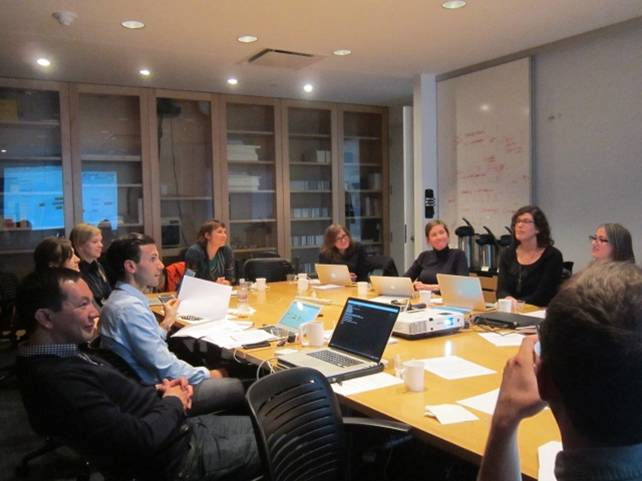
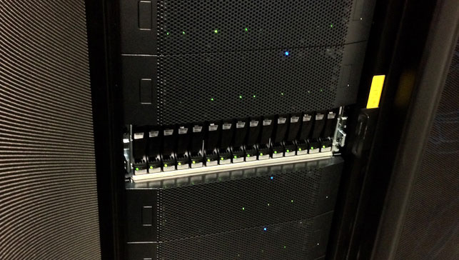

自2005年本計畫執行以來，媒體藝術已主要屬於數位領域。數位典藏作品與已經數位化的傳統作品需要適當的儲存環境。此篇範式內容將著重在為數位藝術藏品建立儲存系統和將數位藏品移入這些系統的挑戰。

圖說：馮夢波，《長征：重啟》（2008）。Video game (color, sound),電視遊戲（彩色，有聲），訂製電腦軟體和無線遊戲控制器。尺寸和時間長度視場地調整。紐約現代現代藝術博物館。匿名提供，2008。©2015馮夢波。展示圖，新遺產之場景：館藏當代藝術展，紐約現代藝術博物館（2015年3月7日至2016年4月10日）。數位圖像©2015紐約現代藝術博物館。攝影：Thomas Griesel。

 
我們的目標是提供有用的資訊給任何關注錄像藝術藏品的小型、中型或大型組織和外部機構。在文中強調了核心原則，也將在文中以引述標示不同藏品需求的不同處理方法。我們邀請你填寫一份問卷，這個動作會幫你初步了解藏品的需求，其結果將構成整體保存系統設計的基礎。
 

<section id="Core-Principles" class="section scrollspy" markdown="1">

  

      核心原則
      
     

      <ul>
       <li> 對待數位作品如同一般藝術品一樣：辨別、編目、描述、維護處理、記錄和追蹤 </li>
       <li> 做好變通的準備：必要的技能會不斷地演變且不限於既有專業範圍 </li>
       <li> 為現有的藏品建立儲存空間，並為未來打下基礎 </li>
       <li> 建置藏品儲存空間的預算須同時包含維運費用</li>  
       <li> 數位藏品需要主動去維護，不適合被動式的儲存</li>
     </ul>
     

</section>

<section id="Know-Your-Collection" class="section scrollspy" markdown="1">

## 了解你的收藏

首先要了解你擁有什麼？以及它將如何增長？這將是與基礎架構、人員需求和預算有關的進一步決策基礎。為了協助你進行初步評估，我們創建了一個收集所有核心資料的問卷。

<a href="{{ site.url }}/downloads/Survey_Scoping-your-collection.pdf">
  

    

      調查：界定你的數位藏品範圍
      
這項調查旨在幫助你了解數位藏品的大致狀況，儘管這幾頁僅涉及數位錄像的需求，但其他類型的數位藝術作品或數位組件的存在也會影響既有系統的決策，例如儲存需求。

    
 <!-- end of card-content -->
    

    <a href="{{ site.url }}/downloads/Survey_Scoping-your-collection.pdf">
      
<i class="large material-icons">play_for_work</i>藏品調查
        

        </a>
        

          
  
 <!-- end of card -->

  
為了規劃藏品的儲存和管理，定義藏品類別和相關文件紀錄會很有幫助，這可能包括以下內容：

<ul class="collapsible" data-collapsible="accordion">
<li>
  
母檔案 (Masters)

  

母帶由藝術家、藝廊或捐贈者提供，可以是數位檔案、磁帶、膠卷、光碟或其他。

</li>
<li>
  
保存母檔案 (Preservation Masters) 

  

由機構或藝廊為保存目的而製作的藝術家母帶的副本或衍生品。這包含從母帶轉檔為母檔案。

</li>
<li>
  
展示和研究用副本

  

由藝術家或機構為了存取、展覽或出借作品時，而製作的衍生品。

</li>
<li>
  
輔助性資料

  

即建立或來自與藝術品創作過程和預期展示有關的文件紀錄，這包含了藝術家的安裝說明書和展示文件紀錄

</li>
</ul>
 

你需要決定每個類別要以什麼級別來保存，以及藏品間必須的連結方式。根據你的需求，你可能會希望將所有資料集中，或者將其保存在彼此相連的不同位置或系統中。

<h2 class="title">  Simple  </h2>
<h2>  ______________________  </h2>
「我專注於將母檔案保存在稱之為我的『典藏(archive)』的硬碟上，我並不會有條理的保留自己為其他用途製作的衍生性檔案。 有時它們沒有被放到硬碟中，但是我認為只要擁有母檔案，我就可以做出任何格式。」
<h2>  ______________________  </h2>

<h2 class="title"> Medium  </h2>
<h2> ______________________  </h2>
「通常我們會接收所有藝術家提供給我們的東西，儘管我們一直在努力去獲取母檔案。 大部分數位藏品的播放檔案格式是H.264 .mov和ProRes，或當我們能夠直接從藝術家或藝廊處取得的未壓縮母檔案。此外，我們一直在積極地將類比磁帶資料轉錄成數位母檔案。」
<h2> ______________________  </h2>

<h2 class="title">  Complex </h2>
<h2>  ______________________ </h2>
「我們會保留從藝術家處收到的所有檔案。當我們為保存、展覽、借展等目的去創建衍生性檔案時，每個新檔案都會在我們的藏品管理系統中獲得一個組件編號，並且與創建這些檔案的相關詳細資料一起存在資料庫中。我們會有一個能進入數位資產管理系統(DAM)中的可存取副本，以便我們的員工可以直接查看藏品，而不需直接進入數位檔案資料庫。」
<h2>  ______________________ </h2>

</section>

<section id="Assess-Your-Skills" class="section scrollspy" markdown="1">

## 評估你的技能

由紐約現代藝術博物館主辦之數位檔案資料庫和使用者需求的媒體保存維護師和檔案管理員專家會議。數位圖像©2014紐約現代藝術博物館。

照護數位檔案和其他媒體的藝術品本質上沒有區別，所需步驟亦與多數傳統保存維護之專業步驟相似。

例如，當入藏一幅畫作時，會收集該作品的創作、歷史和狀況的資訊，去釐清並保持最佳狀況來典藏作品，而且確保管理與展示能妥善處理。博物館和其他機構已非常擅長確保這些事務都達到標準，並且有專業團隊專責處理。了解此數位檔案為何？其創作過程、歷史和狀態為何？並確立適當的保存與展示也是如此。

如果你是親自維護作品，或是服務於小型組織中，那麼與外部專家的關係會掌握所需技術人員的關鍵方式。

為了增進或取得保存維護藏品所需的技能，請考慮以下事項：

<ul class="collapsible" data-collapsible="accordion">
<li>
  
合作

  

並非每個人都能掌握所有必需技能，因此，合作對於成功維護數位藏品是至關重要的。這包括與外部專家和機構合作，以影片轉置為例，也包含跨機構連接，甚至在有類似需求的機構之間的資源共享。

</li>

<li>
  
研討會與工作坊

  

參加相關研討會是與時俱進的好方法，也可幫助成員發展所需技能，參加或組織特定主題的工作坊是一種有效培養技能的方式。

</li>

<li>
  
專業人員網絡

  

參與專業人員網絡和利用社群資源有助於彼此的經驗交流，以及與面臨類似問題的夥伴間之聯繫。

</li>

<li>
  
僱用新員工

  

根據藏品的規模，可能有必要建立新職務或僱用新員工以確保專業知識的建立與共享。

</li>
</ul>

<h2 class="title"></h2>
「我具備編目和複製檔案製作備份的能力，我可以使用自己的磁帶卡座進行磁帶轉檔，當原始檔案有問題或沒有磁帶卡座時，我會去找專家處理。我與專業剪輯人員一起進行數位影片的轉碼或重製，因為我並不了解所有種類，這樣會無法達到想要的品質。你可能會花費大量時間而無法獲得想要的結果，或者你之後才會發現，如果以其他方式進行操作會更好。」

<h2 class="title"></h2>
「我們有一位全職的藏品管理員，負責監管藝術作品入藏、借展和一般維護的各個層面。此外，我們還有一位兼職員工，專門負責編目和藏品的基礎維護。隨著購入更多的數位媒材，我們聘請了顧問來加快速度並調整我們的藏品管理系統以容納這種媒材，還設置了備份用的雲端儲存和工作流程。」

<h2 class="title"></h2>
「在資訊工程部門的協助下，我們擁有全職的媒體藝術保存維護師、助理媒體保存維護師和數位檔案資料庫經理。我們的影音技術部門負責展示設備的安裝和維護，我們還有幾位專門負責博物館系統TMS ，也就是藏品資料庫管理的工作人員。」

</section>

<section id="Calculate-Your-Budget" class="section scrollspy" markdown="1">

## 衡量你的預算

無論你是私人收藏家還是大型機構，收藏和維護數位藝術都涉及了大量成本。在衡量預算時，要考慮兩種不同類型的成本：資金成本（一次性購買基本的基礎設施或工具，理論上將持續使用數年）以及持續性或經常性成本，這將成為經常性營運預算的一部分，可能會隨著你收藏的增長而增加。

根據 [調查問卷]({{ site.url }}/sustaining-your-collection.html#Know-Your-Collection)結果, 你可以開始規劃所需的儲藏空間和估算數位保存、基礎設施和支援的成本，成本範圍從編列硬碟預算到讓資訊工程師開發強大的檔案資料庫。

為了要制訂預算，你將會需要收集以下內容：

<ul class="collapsible" data-collapsible="accordion">
<li>
  
有關你的藏品資訊

  

    <ul>
      <li>你的收藏目前有哪些格式？</li>
      <li>你需要儲存多少資料？</li>
      <li>如果資料是以數位檔案的方式儲存，總計的檔案大小是多少？</li>
      <li>如果是在磁帶上，檔案的時間長度是？</li>
      <li>你打算在什麼時間點將磁帶轉置成數位檔案？</li>
      <li>你的收藏增長有多快？</li>
       
    </ul>
  

</li>
<li>
  
影響決策

  

    <ul>
      <li> 你是否會保留藝術作品的所有副本（例如：藝術家提供的、封存的、除役的母檔案、展示用副本、存取用副本）？</li>
      <li> 你是否會將每個組件與其詮釋資料單獨儲存，還是將藝術作品所有的組件放在一起？</li>
      <li> 你會將什麼類型的詮釋資料和紀錄與組件放在一起，哪些又將存放在其他地方？</li>
       
    </ul>  
  

</li>
<li>
  
人員和設施

  

    <ul>
      <li>你會與外部設施和承包商合作嗎？ 
      你會僱用新員工嗎？</li>
       
    </ul>
  

</li>
    <li>
    
消耗品

    
  
      <ul>
        <li>任何消耗品花費的詳細資料</li>
         
      </ul>
    

   </li>
   <li>
    
處理和實施時間

    

      <ul>
        <li> 有關人員將有多長動手時間的資訊（某些過程可能需要數小時的電腦運算時間來處理，但只需偶爾對其進行監測），這些過程可能包括：</li>
         

        <li>- 材料的初步評估</li>
        <li>- 編目和文件化</li>
        <li>- 從類比轉置到數位</li>
        <li>- 準備好提取資料或轉移到儲存空間</li>
        <li>- 提取或轉移到儲存空間</li>
 
        <li>估算執行時間表也很重要，有助於判斷從頭到尾完成單一項目所需時間，再從那裡延伸推斷。</li>
 
        <li>如果你希望預算與計畫連動，那麼你可能還要知道一個項目從開始到完成所需的時間。</li>
         
       </li>
      </ul>
    

  </li>
</ul>

 

我們建立了一個excel工作表單，讓你可以輸入開銷並計算總額，且以時間圖表的形式呈現：

<a href="{{ site.url }}/downloads/MMA_budget_template.xlsx">
  
<i class="large material-icons">play_for_work</i>預算計算器

    </a>
    

<!--
[Link to the budget template](https://docs.google.com/spreadsheets/d/1WBgSIlsFzoQEWQQaz-cIWYo5LjTrvcYtuWyd9-HnG8g/edit?usp=sharing)-->

 

以下有三個不同的預算範例，以及制訂這些預算的必要注意事項：

<h2 class="title"></h2>
「我們有專門的預算用於員工和數位藏品維護，還有預算用於建置和維護儲存設施，隨著藏品增長變化的可能性，每年都會重新審查預算。」

<h2 class="title"></h2>
「我們確實有個預算主要用於儲存和適度保存維護的評估和開銷，該預算最初是為儲存實體物件而設計的，但從那時起我們將其擴充以涵括數位儲存的預算編列。我們有一個持續支出的雲端儲存費用[在此插入Amazon雲端成本]，並將其他所有內容備份到LTO磁帶。」

<h2 class="title"></h2>
「什麼預算？我沒有預算，因此編目和儲存上的所有投資都讓我感到艱難。但我確實意識到我必須追蹤自己的作品和注重儲存，否則我可能會失去我的作品。當沒怎麼賺錢時，很難分配經費來保存我的作品備份，可是通過讓事情簡單化，我認為我已經能夠以合理的成本支付基本費用。」

### 估算你的儲存成本

對於每個儲存的可能選擇和取決於藏品的檔案大小，你可能需要考慮：

* 設置數位儲存的 __初始費用__

* 永續維護數位儲存的 __持續成本__ 根據你的選擇，這可能包括每年的維護費和遞增擴展成本

* 建立和維護系統所需的 __員工和供應商時間__

預算可以每年設定，也可以根據具體項目規劃。預算需要被監控，以便在發現你的假設不正確時，可以進行調整，例如，所需的時間可能比預期要長，或者改變成本。

</section>

<section id="Review-Collection-Management-Systems" class="section scrollspy" markdown="1">

## 檢閱藏品管理系統

藏品管理系統通常是一個資料庫，其中包含各藝術品的基本資訊，它讓藏品管理者能執行以下基本功能：
 

* 維持一份所有藏品的清單

* 記錄入藏細節，包括藝術家、捐贈或購買以及任何關鍵出處的資料

* 保留展覽、展示或借展的歷史紀錄

* 追蹤藏品之實體與數位部分的位置，包括追蹤數位檔案轉碼和轉置的版本的能力。

* 記錄藝術作品的狀況和技術資料，以便告知正在進行的管理

<h2 class="title"></h2>
「我曾經使用過電子表單，但因為物件太多，變得很難使用，而且那是為了計算和數據資料處理而設計的，而非保存分散的物件紀錄。我現在有一個資料庫，可以容納更多資料，並且更易於瀏覽和搜尋。」

<h2 class="title"></h2>
「我們使用專為博物館設計的免費網路架構的開源資料庫，它使我們能夠為所有內容分配一個連結到核心藝術作品的獨立識別碼。我們可以在主要紀錄中添加入藏、借展和位置資訊，甚至可以使用條碼來追蹤實體藏品的動態。」

<h2 class="title"></h2>
「我們是一個使用TMS藏品管理系統的博物館。我們為作品建立一個物件紀錄，然後為該作品的實體或數位物件建立各自的資料組成，這讓我們能夠記錄屬性、關係和內容資訊，從而有效地集中由許多要素組成的複雜作品的根本資訊。」

根據你的脈絡和藏品規模，藏品管理系統將會大不相同。對於小型機構或個人收藏家，可使用資料庫、電子表單、範本和標準化的詮釋資料來執行藏品管理；對於較大的機構，將需要一個妥善管理的資訊庫用以：

* 提供一個關於不論媒材與形式的整體收藏之連續性資訊給中心資訊點

* 改善某些核心工作流程（例如入藏或借展流程）

* 提供稽核和回報功能

* 允許存取資料和確定使用者編輯資料的權限

* 允許多個使用者更新資訊，並維持為最新版本

使用者和物件的數量越多，工作流程越複雜，則專用資料庫（即藏品管理系統）就越必要。維護藏品清單的軟體類型從Excel電子表單、Filemaker之類的資料庫、開源藏品管理軟體像是 <a href="http://www.collectiveaccess.org/about">CollectiveAccess</a> 或 <a href="http://omeka.org/about/">Omeka</a> 到博物館採用的藏品管理系統，例如： <a href="www.gallerysystems.com/products-and-services/tms/">TMS藏品管理系統</a> Mimsy或機構自行開發的訂製系統。

要找到一個同時涵括上述藏品管理作業和數位保存的系統並不常見。因此，通常情況下會使用不同的系統和工具來滿足這兩項不同的核心需求，例如，除了使用藏品管理系統，也使用數位資產管理系統或數位檔案資料庫。但是在建構或使用藏品管理系統以外的任何專用系統之前，重要的是思考該專用系統如何與現有的藏品管理系統整合。

在一個全手動的環境中，你將可以為數位檔案資料庫的功能整合任何所需資訊（例如校驗和檢視與檔案格式登錄表等），以及將核心藏品管理資料（例如位置追蹤）放到一個資料庫中。對於較大的數位藏品，就時間和準確度而言，利用工具自動化工作流程中的某些功能，會有顯著的好處。通常這會產生你希望記錄和維護的數位藝術作品的資訊。一旦使用專業的（通常具有專利版權）資料庫，與其他資料庫軟體或數位資產管理系統整合就可能是一項具有挑戰性、昂貴的、技術性的作業。

### 組織你的藏品資訊

在多數情況下，一件藝術藏品的資訊將由大量的且經過多次編譯和編輯之紀錄所構成，通常只有一小部分的資訊會被保存在中央資料庫中，許多機構還會為這些相關的檔案設立記錄管理系統。

這裡的困難是要確保在多年之後，當你從儲存處中取出一個數位物件時，你會有足夠的資訊來了解其材料，它們如何被正確地觀看，它們與所屬藝術作品之間的作用，以及最後具有驗證與證明其真實性的能力。

有些特定的資訊是你需要確定保存在檔案中，因此即使丟失了其他資訊，你仍然可以辨認是哪一件藝術作品，且知道檔案本身並沒有被改變。

<ul class="collapsible" data-collapsible="accordion">
<li>
  
核心描述資訊

  

    <ul>
      <li>
        作品名稱和藝術家姓名。如果你有一個藏品管理系統，描述性資訊應包括識別碼，做為該作品紀錄的一部分。這些識別碼必須是持久的，這意味著它們是永久性的，並且永遠不會改變。
      </li>
    </ul>
  

</li>
<li>
  
校驗機制

  

    <ul>
      <li>
       建立校驗和讓你得以確認檔案維持不變。更多資訊請參閱「校驗機制」章節
      </li>
    </ul>  
  

</li>
<li>
  
技術性資訊

  

    <ul>
      <li>
        每個數位檔案在標頭(header)和檔案封包(wrapper)都崁入了技術性資訊。如果你有大量的收藏，需將此資訊在藏品管理系統中的提取與儲存列入考慮，以便能在典藏資料中進行搜尋。      </li>
    </ul>
  

</li>
</ul>

為了確保藝術作品可以在未來被保存維護和展示，還需要留存更多資訊。這既可與文件檔案放在一起，也可存在其他系統中，例如資料庫或藏品管理系統。

<h2 class="title"></h2>
「我們偏好將藝術作品的所有相關資料放在一起，因此我們將所有檔案、展示規格、證書和宣傳文件都放在一個資料夾中。」

<h2 class="title"></h2>
「我們需要在儲存空間和TMS藏品管理系統中持續追蹤個別檔案，並且查看其特定資訊。在我們系統中，最靈活且簡易的方法是給每個組件一個獨立的識別碼，該識別碼可直接連接到藏品管理系統中的藝術作品紀錄和保存維護文件。」

### 數位檔案資料庫

然而藏品管理系統僅是數位事務管理的一部分，因為其通常不會讓核心數位保存工作變得容易。為了滿足這些需求，機構組織通常會使用一個系統或一套系統，稱作數位檔案資料庫。數位檔案資料庫可以有許多功能，用以監控和確保藏品物件能持續被保存維護，就像藏品管理系統一樣，功能的執行方式將取決於實際情況。對於數量少的同質性藏品，可以手動執行許多功能。對於較大量且多樣的藏品，擁有自動化工作流程和系統則具有明顯效益。

此領域近年來發展非常迅速，甚至大型組織也努力開發基礎架構，為配合不斷增長的數位藏品。因此，理解檔案資料庫是重要的，它指的是需被執行的許多功能，且是由一些與數位保存實踐相關的關鍵概念所支持的。

這些功能可能包括：

* 汲取數位物件的自動化工作流程，包含詮釋資料的提出、物件的打包和詮釋資料的儲存

* 為每個數位物件產生一個永久的識別碼，並與相關詮釋資料建立永久關係

* 依需求產生規範化的母檔案。規範化的母檔案是標準化格式的檔案之保存副本。關於何時適合建立規範化的副本存在些爭論。一般來說，影片檔案格式比磁帶格式更不易過時，部分原因是隨著時間的推移，用軟體重放影片要容易些，尤其在使用ffmpeg等開源工具的情況下。

* 產生能存取的衍生性檔案，以及使用者介面用來存取這些衍生性檔案和相關詮釋資料

* 稽核系統和使用者的活動

* 主動監控檔案的完整性

* 藏品特徵的記錄和報告，例如：檔案格式

* 監控保存與維護風險，例如：檔案格式過時和軟體依賴性

</section>

<section id="Design-Your-Storage" class="section scrollspy" markdown="1">
## 設計你的儲存環境

<iframe src="https://player.vimeo.com/video/185972687" width="640" height="480" frameborder="0" webkitallowfullscreen mozallowfullscreen allowfullscreen></iframe>

本節概述為長期數位保存而設計和建立的可靠儲存空間有關的關鍵要素。內容涉及多種情況，不論你正設計低風險的個人儲存方案，還是大型機構。不管你的藏品規模如何，在設計儲存環境時都需要考慮以下核心原則：

  

    

        核心原則
        
       

       <ul>
        <li> 地域性冗餘 - 多個資料副本應異地保存，並且應制訂災害復原計畫。 </li>
        <li> 校驗機制檢查 - 定期察看數位檔案，以防數據資料的損壞或意外更改。 </li>
        <li> 存取和安全性 - 存取數據資料的速度和限制需依用途適當調整，並設置保護級別。 </li>
        <li> 關注技術 - 應密切關注儲存技術的趨勢，以便在需要時轉置到新的儲存媒體。</li>  
      </ul>
       

    

  

以數位保存為目的，對你現有收藏基礎架構界定範圍時，了解標準規格的儲存設置和適用於數位保存的設置之間的區別將很有幫助。標準規格儲存系統是為經常使用的數位內容而設計，一般還包括備份過程，但它們通常無法達到以長期保存數據資料為目的的嚴格要求。例如，在普通的機構資訊系統設置中，備份磁帶在幾個月後會被清除和重新使用是標準做法。經常使用的儲存空間也不大可能有一套系統來識別資訊是否被更改或丟失，當數據資料一直在變化時，無法輕易地分辨有意的更改和意外的更改之間的差異。相對的，保存維護藏品系統需要主動監視數據資料，以便檢測到不必要的更改，比如破壞或損壞。高度的冗餘指在多地點保存備份，使能在出現問題時恢復數據資料，理想情況下，還會有一個災害復原計畫。

### 冗餘

硬碟的壽命從三個月到五年不等。如果你只擁有一個硬碟，然後發生故障，那麼恢復數據資料將非常昂貴，而且可能是場災難。根據經驗： **一份副本等於沒有副本。將三份數據資料副本保存在至少兩種媒材（例如硬碟、伺服器、LTO磁帶、隨身碟、雲端）和至少兩個地點。**

維持檔案備份有多種原因，例如：確保高度可用性以及從糟糕情況、意外修改或刪除中復原的能力。為數據資料備份選擇儲存類型是取決於丟失主要檔案時需要多迅速的存取數據資料。如果速度很重要，這通常將需要在異地有個與主體一模一樣的基礎結構，並具有與外界或存取點的等效連接。該基礎結構會有完整且最新的整體藏品資料副本。

為災難性情況（例如：發生火災、淹水或地震）維護數據資料備份時，其目的僅僅是能夠檢索、重建和存取數據資料。按此說法，便利的存取就不是優先事項。異地儲放LTO磁帶是用於災難性情形復原備份的合適媒材例子之一。

還有許多支援地域性冗餘的選擇，正確的選擇取決於你的預算和收藏量。

硬體：潛在的選擇 (2016)

* 未來5年內0到5TB和小預算的磁碟陣列RAID 1等級
* 5TB至25TB - 磁碟陣列RAID-5或6或7等級
* 25TB或更多 - 某種企業儲存空間或多個支持菊鏈(daisy chaining)的磁碟陣列RAID 5或6或7等級

保持同步多個副本：潛在的選擇

* 手動操作
* 點對點文件共享（P2P）
* 雲端服務（例如：dropbox, crashplan, http://www.cloudwards.net等）

<h2 class="title"></h2>

「我想盡可能以簡單的方式異地儲存3個副本，我買了3個磁碟陣列RAID 1，一個放我的工作室、一個放我家裡、一個放朋友家。為了使3個磁碟陣列RAID 1保持同步，我固定每週手動同步工作室和家裡的磁碟陣列，然後每年兩次與朋友家的磁碟陣列進行同步。」

<h2 class="title"></h2>
「我有大約10 TB不常存取的數據資料，且我有足夠的資金支付雲端儲存的年費。」
「我們有大約10TB的數據資料，並預計在五年之內只會有15TB的數據資料，所以我們有兩個18TB磁碟陣列RAID設備直接連到我住家和辦公室的Mac電腦。我會支付雲端備份服務的年費，讓兩地保持同步，並受益於在雲端中擁有第三份副本。」

<h2 class="title"></h2>
 「我目前管理的藏品有35TB。根據入藏分析，我估計在未來五年內，我們將增長到約50TB。在和資訊部門諮詢後，我發現他們實際早已在兩個地方有一些儲存基礎架構，並且都可以擴展到這種規模。他們增添了我們今年增長所需的儲存量，也擁有未來五年預期增長的預算。我告訴資訊部門這些數位作品非常值錢，因此他們有仔細考慮讀取/寫入的存取權限，相較這個系統上其他類型的數據資料管理更為嚴格。理想情況下，我們應該在三處地點有三份副本，但是不幸的是，預算無法給付雲端儲存的費用，或設立第三個數據資料中心，所以作為替代方案，目前我將數據資料手動備份到LTO磁帶中，且把LTO磁帶放在第三處地點，以防需要從災難情況下復原。

維護你的備份數據資料是為了高度可用性或從災難、意外修改或刪除中復原（或綜合這些原因）。

高度可用性：這是一份你的數據資料的冗餘備份，維護是為了在丟失原始檔案時，仍能在不停工的情況之下提供數據資料的便利存取。通常這意味著在異地有主要基礎架構的備份，並具有與外界或存取點的等效連接，該基礎結構將包含完整且最新的藏品備份。對於容易取得的數據資料備份來說，存取的便捷性至關重要。

災難復原：為災難性情況（例如：發生火災、淹水或地震）維護數據資料備份時，其目的僅僅是能夠檢索、重建和存取數據，按此說法，便利存取就不是優先事項。異地儲放LTO磁帶是用於災難性情形復原備份的合適媒材例子之一。
</section>

<section id="Implement-Fixity" class="section scrollspy" markdown="1">

## 施行校驗機制

當為數據資料建立安全的儲存環境時，你將需要確保數據資料自身的安全，且不會在不知情的情況下變動。此過程稱為校驗機制。在數位保存領域中，這是透過為檔案之定期重新檢查所產出的校驗和來實現。

簡而言之，你的檔案會通過一種演算法（最常用的演算法是MD5和SHA），該演算法會產生特殊的字母數字序列，細微的更改檔案將產出完全不同的校驗和。通過此簡單方法，可以識別任何檔案的更動。有幾種更動可以被此方法識別：損壞提示、資料數據丟失或意外操作。如果你有一個自動監控系統，將會在發生此類變更時發出警示。

一旦你收到或建立檔案後，盡快計算校驗和。這可以指你在接到一件作品後輸出檔案時，或當你從編輯專案或數位化磁帶後輸出檔案時建立校驗和。

磁碟陣列RAID和企業儲存系統提供了一種基本形式的校驗機制。在區塊級監控這些系統中的數據的完整性，區塊級指組成檔案的較小區塊數據。如果一個硬碟故障，系統可以使用冗餘數據區塊及校驗和來恢復丟失的數據資料。但是，這僅能檢測到儲存設備本身發生故障而發生的數據資料損壞，它不會發現使用者或軟體造成檔案的意外損壞、修改或刪除。在數位保存領域中，我們使用文件級還有區塊級檢查的校驗和。

校驗和可以提升區塊級的檢查，因為它是可以隨著檔案被夾帶的證據，並且可以被檢視，而不論其所在的儲存系統種類，它都可以證明自建立以來檔案從未被修改。

### 校驗和工具

這些工具可以簡單地產生校驗和，在離開環境後，不一定需要儲存校驗和值或促使校驗和驗證。

* <a href="https://en.wikipedia.org/wiki/Md5sum">md5</a> - 可藉由Mac或Linux上的終端機運行。

* <a href="https://en.wikipedia.org/wiki/Sha1sum">shasum</a> - 可在Mac、Linux和Windows上運行。

* FCIV（File Checksum Integrity Verifier 檔案校驗和完整性驗證程序）– Windows 命令行工具（command line tool）用於產生MD5或SHA1校驗和。

這些工具建立校驗和及儲存數值，便於事後校驗和的驗證。

* <a href="https://support.apple.com/en-us/HT201259">Checksum+ (OS X)</a> -  使用此工具時，你只需要選擇一個檔案，它就會幫你建立一個校驗和，存在.md5文件中，與檔案相同命名並且放在一起。重複點擊這個.md5文件，它將執行校驗機制的檢查，然後告訴你是否一切正常。如果你使用文字編輯器開啟，將顯示MD5校驗和以及其所屬檔案。將.md5和原始檔案存在同一文件夾中很重要。

* <a href="http://www.fastsum.com/">Fastsum</a> - 適用於Windows。

* <a href="https://en.wikipedia.org/wiki/BagIt">BagIt</a> - 由美國國會圖書館開發，此工具用於命令行（command line）介面。 BagIt最初是為了將檔案從一個地方安全地傳輸到另一個地方而創建的，通過將原始數據資料打包到一個「袋子」（文件夾）中，並為其中的每個檔案建立校驗和。它也以文字的方式在文件夾中存了有關日期和軟體版本的資訊，並建立所有文字的校驗和，也包含校驗和本身。 <a href="https://www.youtube.com/playlist?list=PL1763D432BE25663D">在此有一系列教學影片</a>。

* <a href="https://www.avpreserve.com/tools/fixity/">Fixity</a> - AVPreserve 建立了一個工具，讓使用者能識別該程序以每月、每週或每天自動檢查的七種功能。

* <a href="https://www.archivematica.org/">Archivematica</a> - 附帶於命令行基礎工具用於運行校驗機制查驗。

* <a href="https://www.nagios.com/products/nagios-core/ ">Nagios</a> - 資訊基礎結構監控和警示的開源工業標準。提供<a href="http://bit.ly/1p5KDGO">各種校驗和外掛<a/>

* ●	有關更多可能的校驗和工具， <a href="http://coptr.digipres.org/Category:Fixity">請點擊此處</a>

<h2 class="title"></h2>
「我在購入作品時使用BagIt來產生校驗和，以確保安全傳輸到我的中央儲存設備。資料進入我們的檔案資料庫後，便會使用AVPreserve的「Fixity」工具。它非常有用，因為它在後台運行，不僅可以提醒我們修改檔案，而且還可以自上次檢查後執行刪除、移動、重新命名和新增。」

<h2 class="title"></h2>
「我立即使用BagIt將檔案從購得硬碟傳輸到伺服器中，放在一個文件夾中，並制訂每個月驗證一次校驗和。由於我的檔案放置在三個地點，我會對所有文件夾執行『bag verifyvalid』命令。我以前是手動操作，但是我的資訊部門編寫了一個非常簡單的bash腳本，針對提供bash腳本的所有文件夾執行『bag verifyvalid』命令。」

<h2 class="title"></h2>
「我不會手動建立或檢查任何校驗和，但是我深入研究它且我發現用於三地同步的雲端服務實際上具有校驗和檔案，而且保留了無限版本的歷史紀錄。所以如果我發現無法打開檔案是因為檔案已經損壞或意外刪除，理論上是可以恢復到最後的已知正常狀態。唯一的缺點是不會自動通知我是否有東西被刪除、修改或損壞，因為它不知道意外和故意修改之間的區別。」

<h2 class="title"></h2>
「我們使用本地端但可遠端管理的數位保存軟體（SaaS按需即用軟體）作為解決方案。我們在購入作品時使用BagIt來產生校驗和，但在資料進入我們的檔案資料庫後，將由我們的服務提供商監控和管理校驗機制。」

<h2 class="title"></h2>
「我與我的資訊工程部門合作，因為他們必須滿足支付卡規格（PCI compliance）的標準，這需要他們有基於安全目的監控檔案完整性的軟體。他們擁有像是Nagios或Tripwire之類的軟體，可以設定定期監控校驗和，還可以應對系統的企業信用度，並且在發生任何更改時向我發送電子郵件警示。」

</section>

<section id="Provide-Access" class="section scrollspy" markdown="1">

## 提供和限制存取

在設計儲存環境時，你需要考慮誰可以存取和以及如何存取。最佳做法是限制對母檔案的存取，既可以防止不必要的更改，也基於法律和著作權方面的因素。記錄每次系統資料是被誰存取的非常重要，這與具有稽核要求的收藏機構尤其相關。

根據是誰存取你的藏品，你可能得考慮將母檔案的壓縮衍生檔儲存在一個更易於存取的位置。這不僅比存取大型的未壓縮母檔案更加實際，而且還可以減少存取母檔案所造成的風險。

<h2 class="title"></h2>
「不同級別權限是由我們的數位檔案資料庫管理員去設定與維護的，每次下載數位藏品物件時，皆留有紀錄是誰做的和為什麼這樣做。」

<h2 class="title"></h2>
「存取權限僅對少部分的藏品相關工作人員開放。磁碟陣列RAID連結內部網路，並不對外。人們對於雲端儲存系統有些顧慮，但我們被告知它相當安全。LTO磁帶被存放在我們的一般藝術儲存設施中，該設施有門禁卡和門禁系統。」

<h2 class="title"></h2>
「我最擔心的是人們未經許可使用母檔案。一旦我為某一目的提供了高畫質檔案，它們有時會在未經允許的情況下傳輸並重新出現在其他地方。在我的工作室裡，這不是問題，存取是相當開放的。」

</section>

<section id="Keep-up-with-Technology" class="section scrollspy" markdown="1">

## 技術同步

儲存技術日新月異，因此隨時更新和即時瞭解非常重要。你應該注意所選擇的儲存系統的長期耐久性，並主動轉置到持續性更好的儲存媒體或服務，你將需要考慮到儲存媒體本身和存取設備的可靠性與可用性。

例如，如果你的儲存系統包含LTO磁帶，你將需要檢查那款磁帶任何的製造問題、LTO版本更新、LTO驅動器的可用性與兼容性。

<h2 class="title"></h2>
「我們能夠產出資料庫中檔案類型的統計資訊，並且可以做出相應的計畫。」

<h2 class="title"></h2>
「我嘗試採用被認為是最好的檔案格式來長期保存我的母檔案，透過數位保存維護界發佈的部落格和白皮書。但是，我經常發現當某些東西在過期後就停止運作。在升級電腦或操作系統後，我就在備份硬碟時遇到了問題，然後我不得不使用舊電腦去將東西移存到新的硬碟上。」

<h2 class="title"></h2>
「我們仰賴顧問的專業知識來告訴我們應該注意什麼。我們通常會盡量遵循幾乎沒有壓縮的、開放格式等的最佳數位保存方法。至於在系統方面，仍靠我們的顧問（每年至少請來一次）來評估儲存空間和檔案需求，並為我們提出建議。」

</section>
